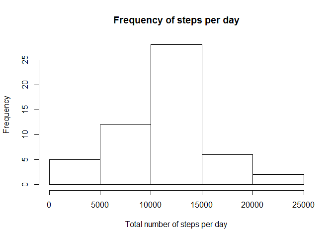
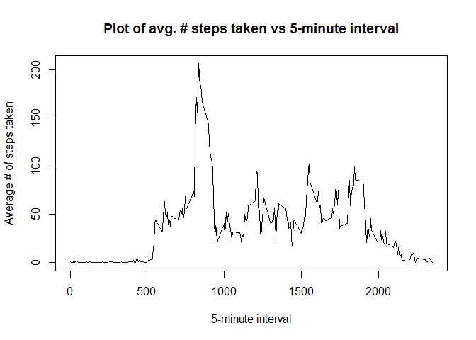
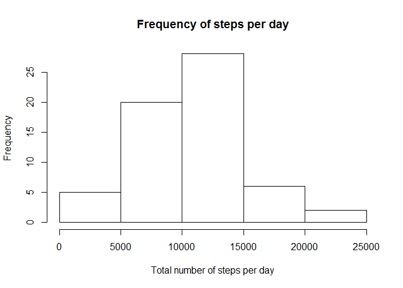
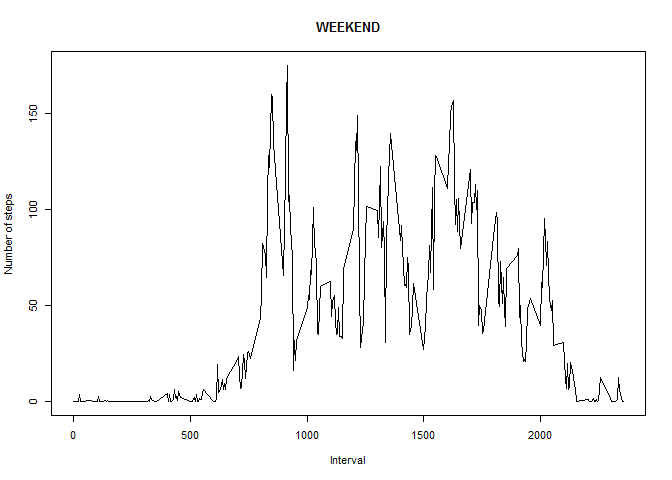
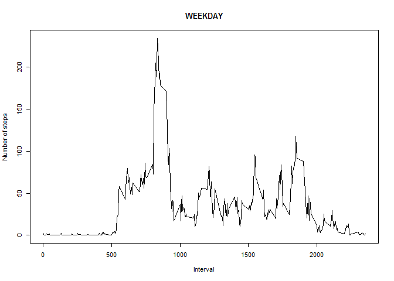

# Reproducible Research: Peer Assessment 1

## Pre-Initialization
Before going through the calculations and processing of the data, load required libraries, change the current working directory to match where the root folder containing the README, activity and R markdown files ("RepData_PeerAssessment1"). Code chunks will be echoed, specifying the global flag echo=TRUE. 


```r
library(plyr)
library(tools)
library(knitr)
library(markdown)
setwd("~/RepData_PeerAssessment1/")
opts_chunk$set(echo=TRUE)
```

Should any of the libraries be missing, please issue:

```r
install.packages("plyr")
install.packages("tools")
install.packages("knitr")
install.packages("markdown")
```

The report was Knited from the RStudio editor, but can also be knited with:

```r
knit("PA1_template.Rmd") ## generates md file
markdownToHTML("PA1_template.md", "PA1_template.html") # required for md to html 
```
## Loading and preprocessing the data
To load the data, the zip file needs to be extracted into the working directory, thus giving a csv file in the working directory. This csv file is then read.


```r
zip_file <- "activity.zip"
csv_file <- unzip(zip_file)
activity <- read.csv(csv_file)
```

The variables bundled with the data set are:

* steps: # steps in a 5-minute interval (NA's represent missing values)
* date: The date on which the measurement was taken (YYYY-MM-DD format)
* interval: Id. for a 5-minute interval on a given date

## What is mean total number of steps taken per day?
From this part and until specified, the missing values in the dataset will be ignored. To answer the question, the total number of steps per day is calculated and then ploted on a histogram.

```r
activity_clean <- na.omit(activity)
steps_day <- aggregate(steps ~ date, data = activity_clean, FUN = sum)
hist(x=steps_day$steps, main = "Frequency of steps per day", 
     xlab="Total number of steps per day", ylab="Frequency")
```

 

Moreover, the mean and the median of the total number of steps taken per day are calculated.
The mean of the total number of steps taken per day is:

```r
mean_steps <- mean(steps_day$steps)
print(mean_steps)
```

```
## [1] 10766.19
```

The median of the total number of steps taken per day is:

```r
median_steps <- median(steps_day$steps)
print(median_steps)
```

```
## [1] 10765
```

## What is the average daily activity pattern?
To answer this question, a time series plot of the 5 minute interval and the average number of steps taken is made.

```r
steps_interval <- aggregate(steps ~ interval, data = activity_clean, FUN = mean)
plot(y=steps_interval$steps, x=steps_interval$interval, type = "l", main = "Plot of avg. # steps taken vs 5-minute interval", 
     xlab="5-minute interval", ylab="Average # of steps taken")
```

 

From the graph and more particularly the data used to obtain the graph, the 5-minute interval containing the maximum number of steps is:

```r
max_interval <- steps_interval$interval[which.max(steps_interval$steps)]
print(max_interval)
```

```
## [1] 835
```

## Imputing missing values
In the previous section, data containing NA's was left out, and from this point onwards a calculated value will be used to reduce possible bias on calculations.

This is important because the number of missing values (NA's) in the original dataset is:

```r
length(activity$steps)-length(activity_clean$steps)
```

```
## [1] 2304
```

or simply calculated as:

```r
sum(is.na(activity))
```

```
## [1] 2304
```

In order to determine a good strategy for filling in the missing values, let's take a look of what is the distribution for the missing values.

```r
act <- subset(activity, is.na(activity$steps))
data_frame_na <- count(act, 'date')
print(data_frame_na)
```

```
##         date freq
## 1 2012-10-01  288
## 2 2012-10-08  288
## 3 2012-11-01  288
## 4 2012-11-04  288
## 5 2012-11-09  288
## 6 2012-11-10  288
## 7 2012-11-14  288
## 8 2012-11-30  288
```

From which it can be seen that there are 8 days with all missing values, 0 days have partially missing values, and the rest of the days have all the values. An adequate method to fill in the missing values is then to use the mean and median values for the 5-minute intervals. A weight factor of 0.4 is given to the median and 0.6 to the mean.

```r
steps_interval_median <- aggregate(steps ~ interval, data = activity_clean, FUN = median)
activity_imput <- activity
activity_imput$steps[is.na(activity_imput$steps)] = round(0.6*as.numeric(steps_interval$steps)+0.4*as.numeric(steps_interval_median$steps))
```

The histogram of the total number of steps taken each day for the imputed data set is then:

```r
steps_day_im <- aggregate(steps ~ date, data = activity_imput, FUN = sum)
hist(x=steps_day_im$steps, main = "Frequency of steps per day", 
     xlab="Total number of steps per day", ylab="Frequency")
```

 

The mean of the total number of steps taken per day is:

```r
mean_steps_im <- mean(steps_day_im$steps)
print(mean_steps_im)
```

```
## [1] 10260.46
```

The median of the total number of steps taken per day is:

```r
median_steps_im <- median(steps_day_im$steps)
print(median_steps_im)
```

```
## [1] 10395
```

Using the methodology to imput the missing values, the median and mean values seem to drop to about 95% of the values calculated earlier on. Additionally, the frequency between 5000 and 10000 total steps per day increased considerably.

## Are there differences in activity patterns between weekdays and weekends?
To answer this question, the date in the dataset must be distinguished from weekday and weekend. For this a new column will be appended to the imputed dataset.

```r
var <- factor(format(as.Date(activity_imput$date), "%u") %in% c(6, 7) == TRUE, labels=c("WEEKDAY","WEEKEND")) ## Saturday should be = 6 and Sunday = 7 in the previous call
activity_imput$daytype <- var
```

Finally, to visually see the difference between the weekend and weekday behavior, two plots are made. The former contains a time series plot of the 5-minute interval and the average number of steps taken across weekend days, and the latter across weekday days. 

```r
layout(matrix(c(1,1,1,1), byrow = TRUE))
for (type in c("WEEKEND", "WEEKDAY")) {
    steps_type <- aggregate(steps ~ interval, data = activity, 
                            subset = (activity_imput$daytype == type), FUN = mean)
    plot(y=steps_type$steps, x=steps_type$interval, 
         type = "l", main = type, xlab="Interval", ylab="Number of steps")
}
```

  
